# 实验一

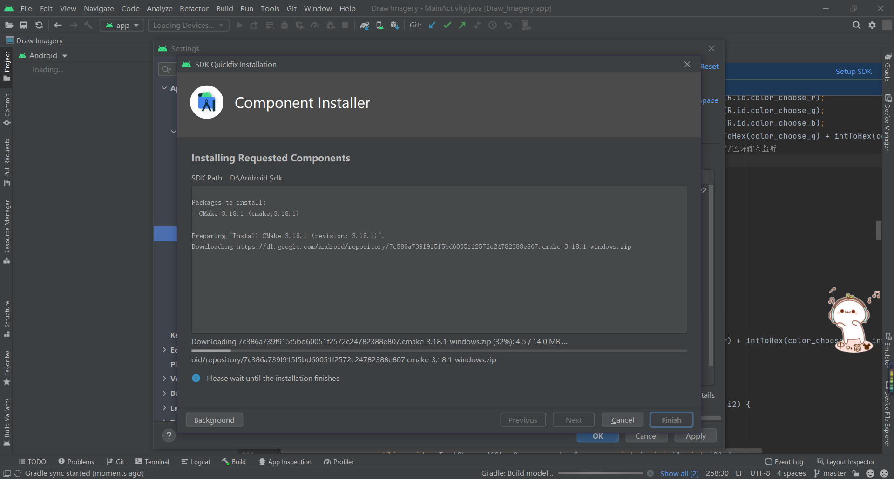

测试AndroidStudio

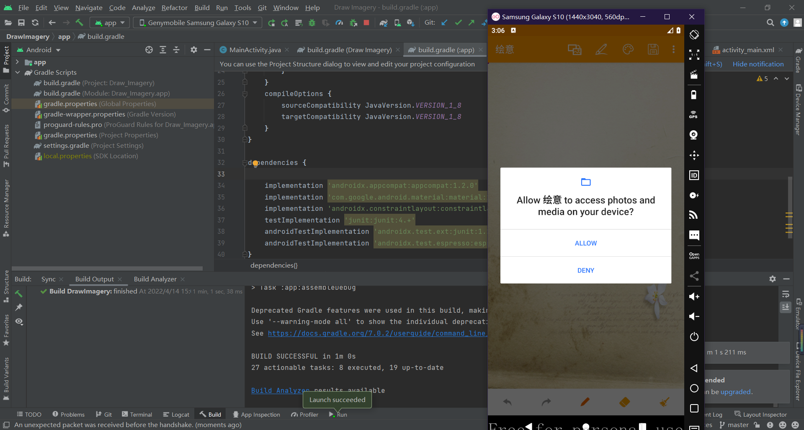

安装Anaconda

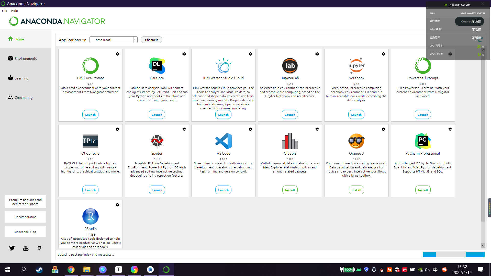

调试jupyter

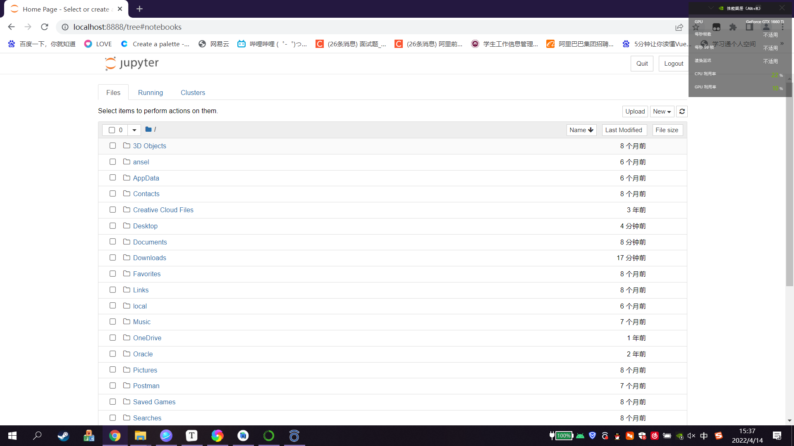

# 实验二

先将PPT中功能、布局代码实现

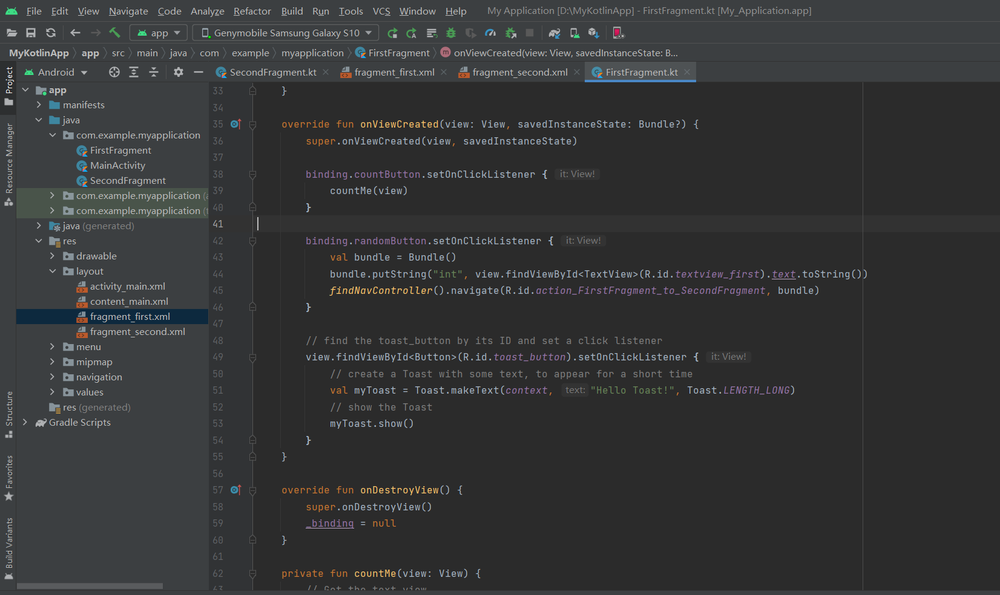

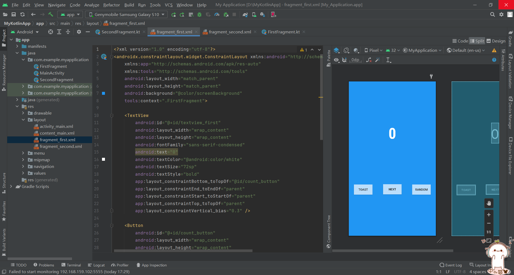

### 扩展功能（注释中为bundle实现）

在导航视图中设置参数并build，生成参数文件

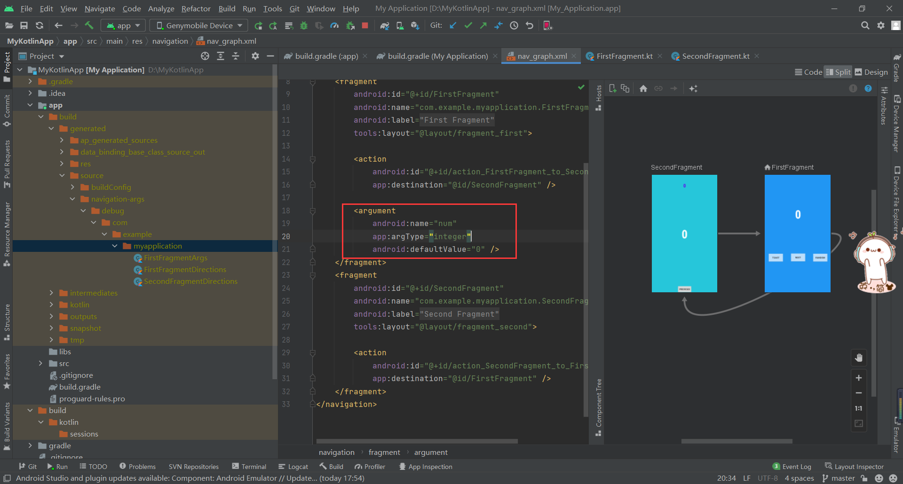

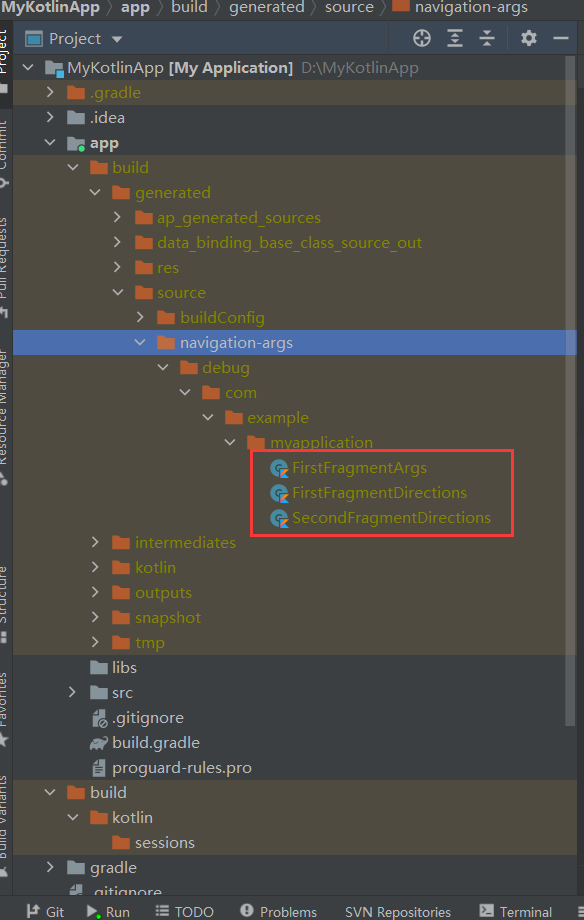

在第一个页面中使用safeargs进行数据传输

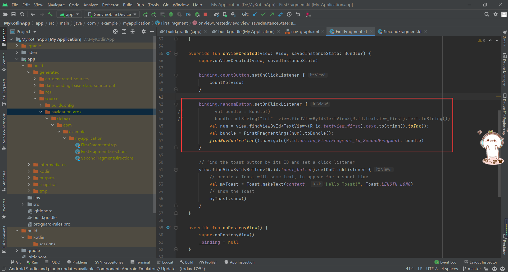

设置第二个页面的代码，接收并显示数据，设置随机数

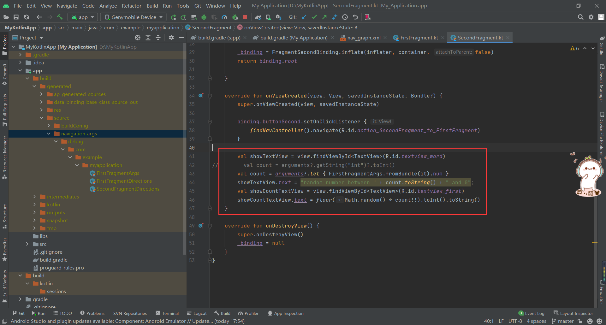

效果展示

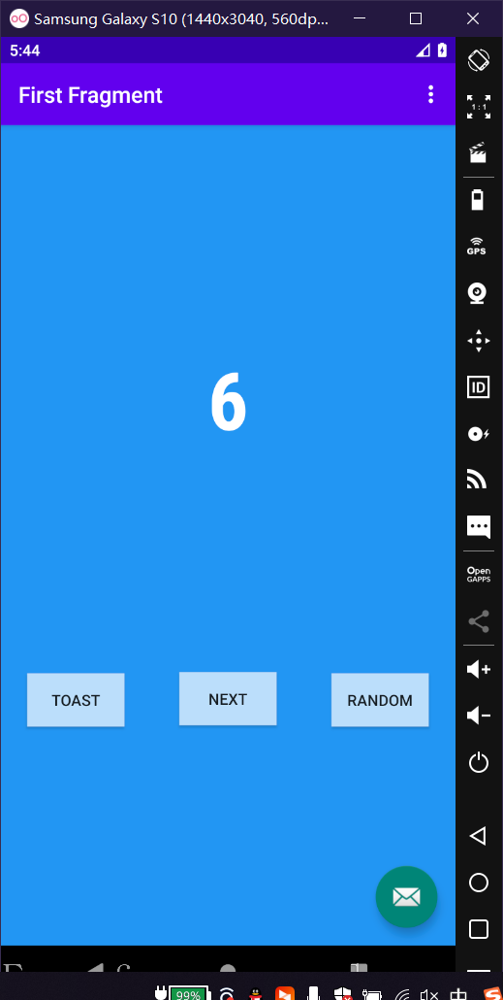

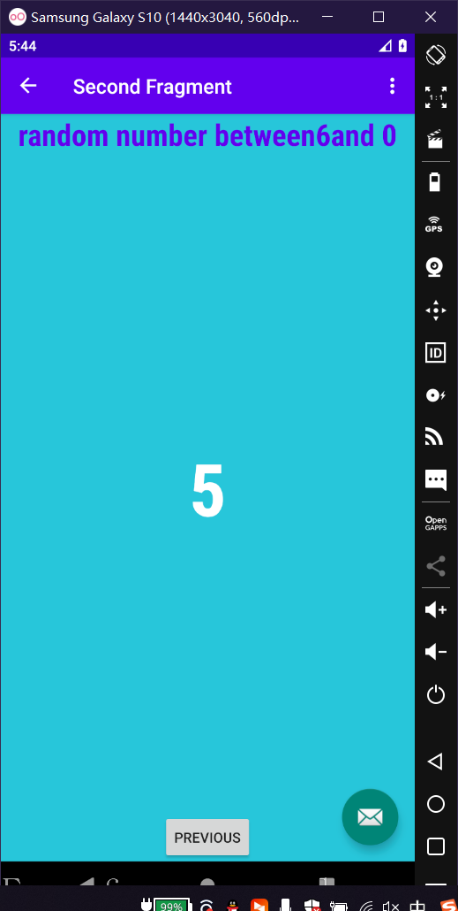

# 实验三

先按照CSDN中步骤下载并build相应文件

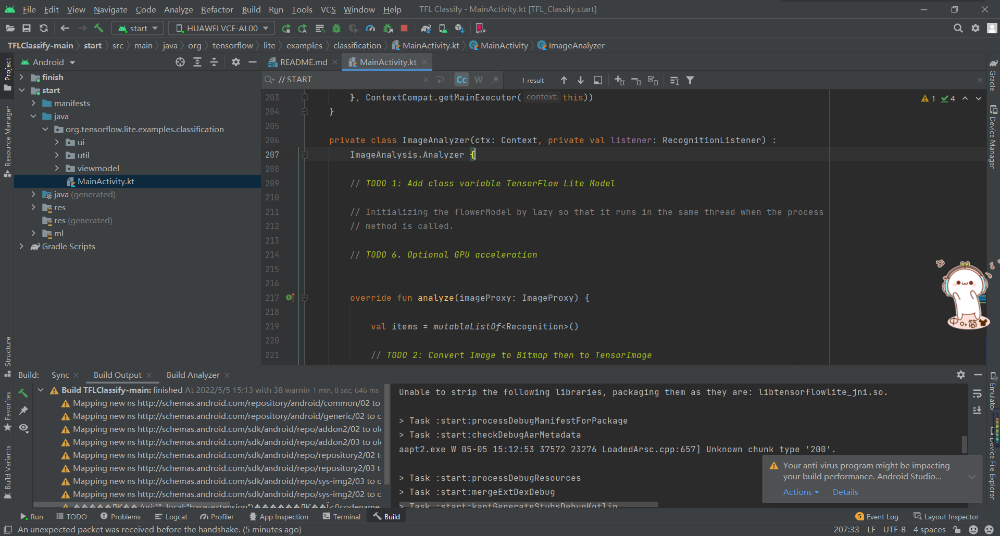

添加对应识别代码

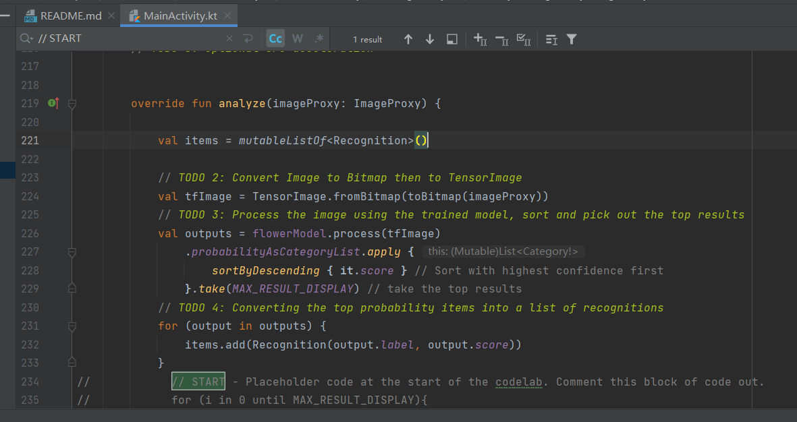

安装到真机

给予权限

识别对应花卉

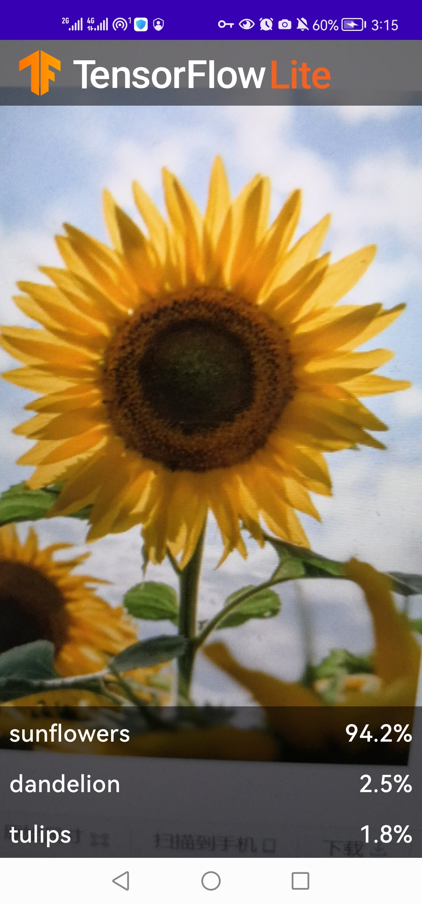

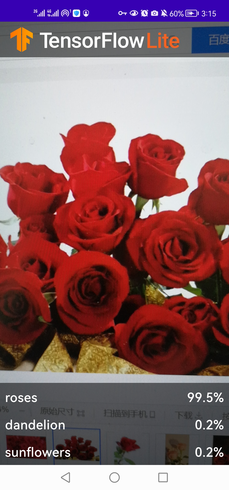

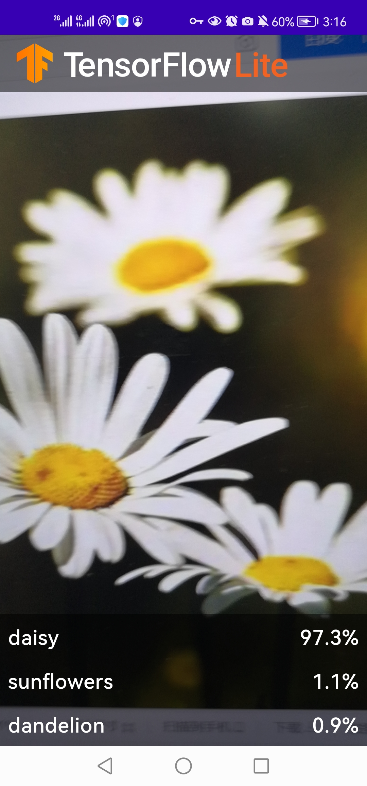
