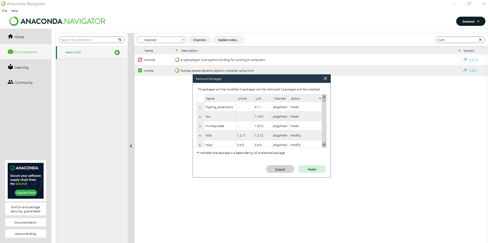

[TOC]

# 实验一


测试AndroidStudio


安装Anaconda


调试jupyter


# 实验二

先将PPT中功能、布局代码实现


## 扩展功能（注释中为bundle实现）

在导航视图中设置参数并build，生成参数文件


在第一个页面中使用safeargs进行数据传输


设置第二个页面的代码，接收并显示数据，设置随机数


效果展示


# 实验三

先按照CSDN中步骤下载并build相应文件


添加对应识别代码


安装到真机


给予权限


识别对应花卉


# 实验四

## 选择排序


```python
def selection_sort(arr):
    if len(arr) < 0:
        return
    for i in range(len(arr)):
        min = i
        for j in range(i, len(arr)):
            if(arr[j] < arr[min]):
                min = j
        temp = arr[i]
        arr[i] = arr[min]
        arr[min] = temp
```


```python
def test():
    arr = [1, 3, 6, 22, 3, 5, 2, 3, 5, 2, 35, -2]
    selection_sort(arr)
    print(arr)
```


```python
test();
```

    [-2, 1, 2, 2, 3, 3, 3, 5, 5, 6, 22, 35]


## 设置


```python
%matplotlib inline
import pandas as pd
import matplotlib.pyplot as plt
import seaborn as sns
```

### 读取数据集 


```python
df = pd.read_csv('fortune500.csv')
```

## 检查数据集


```python
df.head()
```


<div>
<style scoped>
    .dataframe tbody tr th:only-of-type {
        vertical-align: middle;
    }


    .dataframe tbody tr th {
        vertical-align: top;
    }
    
    .dataframe thead th {
        text-align: right;
    }

</style>

<table border="1" class="dataframe">
  <thead>
    <tr style="text-align: right;">
      <th></th>
      <th>Year</th>
      <th>Rank</th>
      <th>Company</th>
      <th>Revenue (in millions)</th>
      <th>Profit (in millions)</th>
    </tr>
  </thead>
  <tbody>
    <tr>
      <th>0</th>
      <td>1955</td>
      <td>1</td>
      <td>General Motors</td>
      <td>9823.5</td>
      <td>806</td>
    </tr>
    <tr>
      <th>1</th>
      <td>1955</td>
      <td>2</td>
      <td>Exxon Mobil</td>
      <td>5661.4</td>
      <td>584.8</td>
    </tr>
    <tr>
      <th>2</th>
      <td>1955</td>
      <td>3</td>
      <td>U.S. Steel</td>
      <td>3250.4</td>
      <td>195.4</td>
    </tr>
    <tr>
      <th>3</th>
      <td>1955</td>
      <td>4</td>
      <td>General Electric</td>
      <td>2959.1</td>
      <td>212.6</td>
    </tr>
    <tr>
      <th>4</th>
      <td>1955</td>
      <td>5</td>
      <td>Esmark</td>
      <td>2510.8</td>
      <td>19.1</td>
    </tr>
  </tbody>
</table>

</div>


```python
df.tail()
```


<div>
<style scoped>
    .dataframe tbody tr th:only-of-type {
        vertical-align: middle;
    }


    .dataframe tbody tr th {
        vertical-align: top;
    }
    
    .dataframe thead th {
        text-align: right;
    }

</style>

<table border="1" class="dataframe">
  <thead>
    <tr style="text-align: right;">
      <th></th>
      <th>Year</th>
      <th>Rank</th>
      <th>Company</th>
      <th>Revenue (in millions)</th>
      <th>Profit (in millions)</th>
    </tr>
  </thead>
  <tbody>
    <tr>
      <th>25495</th>
      <td>2005</td>
      <td>496</td>
      <td>Wm. Wrigley Jr.</td>
      <td>3648.6</td>
      <td>493</td>
    </tr>
    <tr>
      <th>25496</th>
      <td>2005</td>
      <td>497</td>
      <td>Peabody Energy</td>
      <td>3631.6</td>
      <td>175.4</td>
    </tr>
    <tr>
      <th>25497</th>
      <td>2005</td>
      <td>498</td>
      <td>Wendy's International</td>
      <td>3630.4</td>
      <td>57.8</td>
    </tr>
    <tr>
      <th>25498</th>
      <td>2005</td>
      <td>499</td>
      <td>Kindred Healthcare</td>
      <td>3616.6</td>
      <td>70.6</td>
    </tr>
    <tr>
      <th>25499</th>
      <td>2005</td>
      <td>500</td>
      <td>Cincinnati Financial</td>
      <td>3614.0</td>
      <td>584</td>
    </tr>
  </tbody>
</table>

</div>


```python
df.columns = ['year', 'rank', 'company', 'revenue', 'profit']
```


```python
len(df)
```


    25500


```python
df.dtypes
```


    year         int64
    rank         int64
    company     object
    revenue    float64
    profit      object
    dtype: object


```python
non_numberic_profits = df.profit.str.contains('[^0-9.-]')
df.loc[non_numberic_profits].head()
```


<div>
<style scoped>
    .dataframe tbody tr th:only-of-type {
        vertical-align: middle;
    }


    .dataframe tbody tr th {
        vertical-align: top;
    }
    
    .dataframe thead th {
        text-align: right;
    }

</style>

<table border="1" class="dataframe">
  <thead>
    <tr style="text-align: right;">
      <th></th>
      <th>year</th>
      <th>rank</th>
      <th>company</th>
      <th>revenue</th>
      <th>profit</th>
    </tr>
  </thead>
  <tbody>
    <tr>
      <th>228</th>
      <td>1955</td>
      <td>229</td>
      <td>Norton</td>
      <td>135.0</td>
      <td>N.A.</td>
    </tr>
    <tr>
      <th>290</th>
      <td>1955</td>
      <td>291</td>
      <td>Schlitz Brewing</td>
      <td>100.0</td>
      <td>N.A.</td>
    </tr>
    <tr>
      <th>294</th>
      <td>1955</td>
      <td>295</td>
      <td>Pacific Vegetable Oil</td>
      <td>97.9</td>
      <td>N.A.</td>
    </tr>
    <tr>
      <th>296</th>
      <td>1955</td>
      <td>297</td>
      <td>Liebmann Breweries</td>
      <td>96.0</td>
      <td>N.A.</td>
    </tr>
    <tr>
      <th>352</th>
      <td>1955</td>
      <td>353</td>
      <td>Minneapolis-Moline</td>
      <td>77.4</td>
      <td>N.A.</td>
    </tr>
  </tbody>
</table>

</div>


```python
len(df.profit[non_numberic_profits])
```


    369


```python
bin_sizes, _, _ = plt.hist(df.year[non_numberic_profits], bins=range(1955, 2006))
```


​    

​    


```python
df = df.loc[~non_numberic_profits]
df.profit = df.profit.apply(pd.to_numeric)
```


```python
len(df)
```


    25131


```python
df.dtypes
```


    year         int64
    rank         int64
    company     object
    revenue    float64
    profit     float64
    dtype: object


## 使用matplotlib进行绘图


```python
group_by_year = df.loc[:, ['year', 'revenue', 'profit']].groupby('year')
avgs = group_by_year.mean()
x = avgs.index
y1 = avgs.profit
def plot(x, y, ax, title, y_label):
    ax.set_title(title)
    ax.set_ylabel(y_label)
    ax.plot(x, y)
    ax.margins(x=0, y=0)
```


```python
fig, ax = plt.subplots()
plot(x, y1, ax, 'Increase in mean Fortune 500 company profits from 1955 to 2005', 'Profit (millions)')
```


​    

​    


```python
y2 = avgs.revenue
fig, ax = plt.subplots()
plot(x, y2, ax, 'Increase in mean Fortune 500 company revenues from 1955 to 2005', 'Revenue (millions)')
```


​    

​    


```python
def plot_with_std(x, y, stds, ax, title, y_label):
    ax.fill_between(x, y - stds, y + stds, alpha=0.2)
    plot(x, y, ax, title, y_label)
fig, (ax1, ax2) = plt.subplots(ncols=2)
title = 'Increase in mean and std Fortune 500 company %s from 1955 to 2005'
stds1 = group_by_year.std().profit.values
stds2 = group_by_year.std().revenue.values
plot_with_std(x, y1.values, stds1, ax1, title % 'profits', 'Profit (millions)')
plot_with_std(x, y2.values, stds2, ax2, title % 'revenues', 'Revenue (millions)')
fig.set_size_inches(14, 4)
fig.tight_layout()
```


​    

​    

# 实验五

先安装耗时较长的tensorflow模块


再安装项目tflite-model-maker模块


在jupyter上运行代码，报错


卸载llvmlite模块



再次在jupyter上运行代码


以下是jupyter输出记录

```python
!pip install tflite-model-maker
```

    Requirement already satisfied: tflite-model-maker in d:\anaconda\lib\site-packages (0.3.4)
    Requirement already satisfied: librosa==0.8.1 in d:\anaconda\lib\site-packages (from tflite-model-maker) (0.8.1)
    Requirement already satisfied: urllib3!=1.25.0,!=1.25.1,<1.26,>=1.21.1 in d:\anaconda\lib\site-packages (from tflite-model-maker) (1.25.11)
    Requirement already satisfied: Cython>=0.29.13 in d:\anaconda\lib\site-packages (from tflite-model-maker) (0.29.24)
    Requirement already satisfied: neural-structured-learning>=1.3.1 in d:\anaconda\lib\site-packages (from tflite-model-maker) (1.3.1)
    Requirement already satisfied: lxml>=4.6.1 in d:\anaconda\lib\site-packages (from tflite-model-maker) (4.6.3)
    Requirement already satisfied: tensorflow-addons>=0.11.2 in d:\anaconda\lib\site-packages (from tflite-model-maker) (0.17.0)
    Requirement already satisfied: tensorflow-model-optimization>=0.5 in d:\anaconda\lib\site-packages (from tflite-model-maker) (0.7.2)
    Requirement already satisfied: tf-models-official==2.3.0 in d:\anaconda\lib\site-packages (from tflite-model-maker) (2.3.0)
    Requirement already satisfied: flatbuffers==1.12 in d:\anaconda\lib\site-packages (from tflite-model-maker) (1.12)
    Requirement already satisfied: tensorflowjs>=2.4.0 in d:\anaconda\lib\site-packages (from tflite-model-maker) (3.18.0)
    Requirement already satisfied: six>=1.12.0 in d:\anaconda\lib\site-packages (from tflite-model-maker) (1.15.0)
    Requirement already satisfied: numpy>=1.17.3 in c:\users\legion\appdata\roaming\python\python39\site-packages (from tflite-model-maker) (1.19.5)
    Requirement already satisfied: matplotlib<3.5.0,>=3.0.3 in d:\anaconda\lib\site-packages (from tflite-model-maker) (3.4.3)
    Requirement already satisfied: tflite-support>=0.3.1 in d:\anaconda\lib\site-packages (from tflite-model-maker) (0.3.1)
    Requirement already satisfied: tensorflow-hub<0.13,>=0.7.0 in d:\anaconda\lib\site-packages (from tflite-model-maker) (0.12.0)
    Requirement already satisfied: sentencepiece>=0.1.91 in d:\anaconda\lib\site-packages (from tflite-model-maker) (0.1.96)
    Requirement already satisfied: numba==0.53 in d:\anaconda\lib\site-packages (from tflite-model-maker) (0.53.0)
    Requirement already satisfied: absl-py>=0.10.0 in d:\anaconda\lib\site-packages (from tflite-model-maker) (0.15.0)
    Requirement already satisfied: pillow>=7.0.0 in d:\anaconda\lib\site-packages (from tflite-model-maker) (9.0.1)
    Requirement already satisfied: PyYAML>=5.1 in d:\anaconda\lib\site-packages (from tflite-model-maker) (6.0)
    Requirement already satisfied: tensorflow>=2.6.0 in d:\anaconda\lib\site-packages (from tflite-model-maker) (2.6.0)
    Requirement already satisfied: tensorflow-datasets>=2.1.0 in d:\anaconda\lib\site-packages (from tflite-model-maker) (4.5.2)
    Requirement already satisfied: fire>=0.3.1 in d:\anaconda\lib\site-packages (from tflite-model-maker) (0.4.0)
    Requirement already satisfied: soundfile>=0.10.2 in d:\anaconda\lib\site-packages (from librosa==0.8.1->tflite-model-maker) (0.10.3.post1)
    Requirement already satisfied: scikit-learn!=0.19.0,>=0.14.0 in d:\anaconda\lib\site-packages (from librosa==0.8.1->tflite-model-maker) (0.24.2)
    Requirement already satisfied: audioread>=2.0.0 in d:\anaconda\lib\site-packages (from librosa==0.8.1->tflite-model-maker) (2.1.9)
    Requirement already satisfied: packaging>=20.0 in d:\anaconda\lib\site-packages (from librosa==0.8.1->tflite-model-maker) (20.9)
    Requirement already satisfied: pooch>=1.0 in d:\anaconda\lib\site-packages (from librosa==0.8.1->tflite-model-maker) (1.6.0)
    Requirement already satisfied: scipy>=1.0.0 in d:\anaconda\lib\site-packages (from librosa==0.8.1->tflite-model-maker) (1.7.1)
    Requirement already satisfied: resampy>=0.2.2 in d:\anaconda\lib\site-packages (from librosa==0.8.1->tflite-model-maker) (0.2.2)
    Requirement already satisfied: decorator>=3.0.0 in d:\anaconda\lib\site-packages (from librosa==0.8.1->tflite-model-maker) (5.1.1)
    Requirement already satisfied: joblib>=0.14 in d:\anaconda\lib\site-packages (from librosa==0.8.1->tflite-model-maker) (1.1.0)
    Requirement already satisfied: setuptools in d:\anaconda\lib\site-packages (from numba==0.53->tflite-model-maker) (62.3.2)
    Requirement already satisfied: llvmlite<0.37,>=0.36.0rc1 in d:\anaconda\lib\site-packages (from numba==0.53->tflite-model-maker) (0.36.0)
    Requirement already satisfied: py-cpuinfo>=3.3.0 in d:\anaconda\lib\site-packages (from tf-models-official==2.3.0->tflite-model-maker) (8.0.0)
    Requirement already satisfied: google-cloud-bigquery>=0.31.0 in d:\anaconda\lib\site-packages (from tf-models-official==2.3.0->tflite-model-maker) (3.1.0)
    Requirement already satisfied: dataclasses in d:\anaconda\lib\site-packages (from tf-models-official==2.3.0->tflite-model-maker) (0.6)
    Requirement already satisfied: tf-slim>=1.1.0 in d:\anaconda\lib\site-packages (from tf-models-official==2.3.0->tflite-model-maker) (1.1.0)
    Requirement already satisfied: psutil>=5.4.3 in d:\anaconda\lib\site-packages (from tf-models-official==2.3.0->tflite-model-maker) (5.8.0)
    Requirement already satisfied: pandas>=0.22.0 in d:\anaconda\lib\site-packages (from tf-models-official==2.3.0->tflite-model-maker) (1.3.4)
    Requirement already satisfied: kaggle>=1.3.9 in d:\anaconda\lib\site-packages (from tf-models-official==2.3.0->tflite-model-maker) (1.5.12)
    Requirement already satisfied: opencv-python-headless in d:\anaconda\lib\site-packages (from tf-models-official==2.3.0->tflite-model-maker) (4.5.5.64)
    Requirement already satisfied: google-api-python-client>=1.6.7 in d:\anaconda\lib\site-packages (from tf-models-official==2.3.0->tflite-model-maker) (2.49.0)
    Requirement already satisfied: gin-config in d:\anaconda\lib\site-packages (from tf-models-official==2.3.0->tflite-model-maker) (0.5.0)
    Requirement already satisfied: termcolor in d:\anaconda\lib\site-packages (from fire>=0.3.1->tflite-model-maker) (1.1.0)
    Requirement already satisfied: kiwisolver>=1.0.1 in d:\anaconda\lib\site-packages (from matplotlib<3.5.0,>=3.0.3->tflite-model-maker) (1.4.2)
    Requirement already satisfied: cycler>=0.10 in d:\anaconda\lib\site-packages (from matplotlib<3.5.0,>=3.0.3->tflite-model-maker) (0.10.0)
    Requirement already satisfied: pyparsing>=2.2.1 in d:\anaconda\lib\site-packages (from matplotlib<3.5.0,>=3.0.3->tflite-model-maker) (3.0.4)
    Requirement already satisfied: python-dateutil>=2.7 in d:\anaconda\lib\site-packages (from matplotlib<3.5.0,>=3.0.3->tflite-model-maker) (2.8.2)
    Requirement already satisfied: attrs in d:\anaconda\lib\site-packages (from neural-structured-learning>=1.3.1->tflite-model-maker) (21.4.0)
    Requirement already satisfied: h5py~=3.1.0 in d:\anaconda\lib\site-packages (from tensorflow>=2.6.0->tflite-model-maker) (3.1.0)
    Requirement already satisfied: typing-extensions~=3.7.4 in d:\anaconda\lib\site-packages (from tensorflow>=2.6.0->tflite-model-maker) (3.7.4.3)
    Requirement already satisfied: grpcio<2.0,>=1.37.0 in d:\anaconda\lib\site-packages (from tensorflow>=2.6.0->tflite-model-maker) (1.46.3)
    Requirement already satisfied: astunparse~=1.6.3 in d:\anaconda\lib\site-packages (from tensorflow>=2.6.0->tflite-model-maker) (1.6.3)
    Requirement already satisfied: tensorboard~=2.6 in d:\anaconda\lib\site-packages (from tensorflow>=2.6.0->tflite-model-maker) (2.9.0)
    Requirement already satisfied: keras~=2.6 in d:\anaconda\lib\site-packages (from tensorflow>=2.6.0->tflite-model-maker) (2.9.0)
    Requirement already satisfied: gast==0.4.0 in d:\anaconda\lib\site-packages (from tensorflow>=2.6.0->tflite-model-maker) (0.4.0)
    Requirement already satisfied: tensorflow-estimator~=2.6 in d:\anaconda\lib\site-packages (from tensorflow>=2.6.0->tflite-model-maker) (2.9.0)
    Requirement already satisfied: keras-preprocessing~=1.1.2 in d:\anaconda\lib\site-packages (from tensorflow>=2.6.0->tflite-model-maker) (1.1.2)
    Requirement already satisfied: clang~=5.0 in d:\anaconda\lib\site-packages (from tensorflow>=2.6.0->tflite-model-maker) (5.0)
    Requirement already satisfied: wheel~=0.35 in d:\anaconda\lib\site-packages (from tensorflow>=2.6.0->tflite-model-maker) (0.37.1)
    Requirement already satisfied: google-pasta~=0.2 in d:\anaconda\lib\site-packages (from tensorflow>=2.6.0->tflite-model-maker) (0.2.0)
    Requirement already satisfied: protobuf>=3.9.2 in d:\anaconda\lib\site-packages (from tensorflow>=2.6.0->tflite-model-maker) (3.20.1)
    Requirement already satisfied: wrapt~=1.12.1 in d:\anaconda\lib\site-packages (from tensorflow>=2.6.0->tflite-model-maker) (1.12.1)
    Requirement already satisfied: opt-einsum~=3.3.0 in d:\anaconda\lib\site-packages (from tensorflow>=2.6.0->tflite-model-maker) (3.3.0)
    Requirement already satisfied: typeguard>=2.7 in d:\anaconda\lib\site-packages (from tensorflow-addons>=0.11.2->tflite-model-maker) (2.13.3)
    Requirement already satisfied: dill in d:\anaconda\lib\site-packages (from tensorflow-datasets>=2.1.0->tflite-model-maker) (0.3.5.1)
    Requirement already satisfied: tqdm in d:\anaconda\lib\site-packages (from tensorflow-datasets>=2.1.0->tflite-model-maker) (4.64.0)
    Requirement already satisfied: requests>=2.19.0 in d:\anaconda\lib\site-packages (from tensorflow-datasets>=2.1.0->tflite-model-maker) (2.26.0)
    Requirement already satisfied: promise in d:\anaconda\lib\site-packages (from tensorflow-datasets>=2.1.0->tflite-model-maker) (2.3)
    Requirement already satisfied: tensorflow-metadata in d:\anaconda\lib\site-packages (from tensorflow-datasets>=2.1.0->tflite-model-maker) (1.8.0)
    Requirement already satisfied: dm-tree~=0.1.1 in d:\anaconda\lib\site-packages (from tensorflow-model-optimization>=0.5->tflite-model-maker) (0.1.7)
    Requirement already satisfied: pybind11>=2.6.0 in d:\anaconda\lib\site-packages (from tflite-support>=0.3.1->tflite-model-maker) (2.9.2)
    Requirement already satisfied: uritemplate<5,>=3.0.1 in d:\anaconda\lib\site-packages (from google-api-python-client>=1.6.7->tf-models-official==2.3.0->tflite-model-maker) (4.1.1)
    Requirement already satisfied: google-api-core!=2.0.*,!=2.1.*,!=2.2.*,!=2.3.0,<3.0.0dev,>=1.31.5 in d:\anaconda\lib\site-packages (from google-api-python-client>=1.6.7->tf-models-official==2.3.0->tflite-model-maker) (2.8.0)
    Requirement already satisfied: google-auth<3.0.0dev,>=1.16.0 in d:\anaconda\lib\site-packages (from google-api-python-client>=1.6.7->tf-models-official==2.3.0->tflite-model-maker) (2.6.6)
    Requirement already satisfied: google-auth-httplib2>=0.1.0 in d:\anaconda\lib\site-packages (from google-api-python-client>=1.6.7->tf-models-official==2.3.0->tflite-model-maker) (0.1.0)


```python
!pip install conda-repo-cli==1.0.4
```

    Requirement already satisfied: httplib2<1dev,>=0.15.0 in d:\anaconda\lib\site-packages (from google-api-python-client>=1.6.7->tf-models-official==2.3.0->tflite-model-maker) (0.20.4)
    Requirement already satisfied: pyarrow<9.0dev,>=3.0.0 in d:\anaconda\lib\site-packages (from google-cloud-bigquery>=0.31.0->tf-models-official==2.3.0->tflite-model-maker) (8.0.0)
    Requirement already satisfied: google-cloud-bigquery-storage<3.0.0dev,>=2.0.0 in d:\anaconda\lib\site-packages (from google-cloud-bigquery>=0.31.0->tf-models-official==2.3.0->tflite-model-maker) (2.13.1)
    Requirement already satisfied: google-cloud-core<3.0.0dev,>=1.4.1 in d:\anaconda\lib\site-packages (from google-cloud-bigquery>=0.31.0->tf-models-official==2.3.0->tflite-model-maker) (2.3.0)
    Requirement already satisfied: google-resumable-media<3.0dev,>=0.6.0 in d:\anaconda\lib\site-packages (from google-cloud-bigquery>=0.31.0->tf-models-official==2.3.0->tflite-model-maker) (2.3.3)
    Requirement already satisfied: proto-plus>=1.15.0 in d:\anaconda\lib\site-packages (from google-cloud-bigquery>=0.31.0->tf-models-official==2.3.0->tflite-model-maker) (1.20.4)
    Requirement already satisfied: certifi in d:\anaconda\lib\site-packages (from kaggle>=1.3.9->tf-models-official==2.3.0->tflite-model-maker) (2022.5.18.1)
    Requirement already satisfied: python-slugify in d:\anaconda\lib\site-packages (from kaggle>=1.3.9->tf-models-official==2.3.0->tflite-model-maker) (5.0.2)
    Requirement already satisfied: pytz>=2017.3 in d:\anaconda\lib\site-packages (from pandas>=0.22.0->tf-models-official==2.3.0->tflite-model-maker) (2021.3)
    Requirement already satisfied: appdirs>=1.3.0 in d:\anaconda\lib\site-packages (from pooch>=1.0->librosa==0.8.1->tflite-model-maker) (1.4.4)
    Requirement already satisfied: idna<4,>=2.5 in d:\anaconda\lib\site-packages (from requests>=2.19.0->tensorflow-datasets>=2.1.0->tflite-model-maker) (3.3)
    Requirement already satisfied: charset-normalizer~=2.0.0 in d:\anaconda\lib\site-packages (from requests>=2.19.0->tensorflow-datasets>=2.1.0->tflite-model-maker) (2.0.4)
    Requirement already satisfied: threadpoolctl>=2.0.0 in d:\anaconda\lib\site-packages (from scikit-learn!=0.19.0,>=0.14.0->librosa==0.8.1->tflite-model-maker) (2.2.0)
    Requirement already satisfied: cffi>=1.0 in d:\anaconda\lib\site-packages (from soundfile>=0.10.2->librosa==0.8.1->tflite-model-maker) (1.15.0)
    Requirement already satisfied: tensorboard-plugin-wit>=1.6.0 in d:\anaconda\lib\site-packages (from tensorboard~=2.6->tensorflow>=2.6.0->tflite-model-maker) (1.8.1)
    Requirement already satisfied: tensorboard-data-server<0.7.0,>=0.6.0 in d:\anaconda\lib\site-packages (from tensorboard~=2.6->tensorflow>=2.6.0->tflite-model-maker) (0.6.1)
    Requirement already satisfied: google-auth-oauthlib<0.5,>=0.4.1 in d:\anaconda\lib\site-packages (from tensorboard~=2.6->tensorflow>=2.6.0->tflite-model-maker) (0.4.6)
    Requirement already satisfied: markdown>=2.6.8 in d:\anaconda\lib\site-packages (from tensorboard~=2.6->tensorflow>=2.6.0->tflite-model-maker) (3.3.7)
    Requirement already satisfied: werkzeug>=1.0.1 in d:\anaconda\lib\site-packages (from tensorboard~=2.6->tensorflow>=2.6.0->tflite-model-maker) (2.0.2)
    Requirement already satisfied: googleapis-common-protos<2,>=1.52.0 in d:\anaconda\lib\site-packages (from tensorflow-metadata->tensorflow-datasets>=2.1.0->tflite-model-maker) (1.56.1)
    Requirement already satisfied: colorama in d:\anaconda\lib\site-packages (from tqdm->tensorflow-datasets>=2.1.0->tflite-model-maker) (0.4.4)
    Requirement already satisfied: pycparser in d:\anaconda\lib\site-packages (from cffi>=1.0->soundfile>=0.10.2->librosa==0.8.1->tflite-model-maker) (2.21)
    Requirement already satisfied: grpcio-status<2.0dev,>=1.33.2 in d:\anaconda\lib\site-packages (from google-api-core!=2.0.*,!=2.1.*,!=2.2.*,!=2.3.0,<3.0.0dev,>=1.31.5->google-api-python-client>=1.6.7->tf-models-official==2.3.0->tflite-model-maker) (1.46.3)
    Requirement already satisfied: pyasn1-modules>=0.2.1 in d:\anaconda\lib\site-packages (from google-auth<3.0.0dev,>=1.16.0->google-api-python-client>=1.6.7->tf-models-official==2.3.0->tflite-model-maker) (0.2.8)
    Requirement already satisfied: rsa<5,>=3.1.4 in d:\anaconda\lib\site-packages (from google-auth<3.0.0dev,>=1.16.0->google-api-python-client>=1.6.7->tf-models-official==2.3.0->tflite-model-maker) (4.8)
    Requirement already satisfied: cachetools<6.0,>=2.0.0 in d:\anaconda\lib\site-packages (from google-auth<3.0.0dev,>=1.16.0->google-api-python-client>=1.6.7->tf-models-official==2.3.0->tflite-model-maker) (5.1.0)
    Requirement already satisfied: requests-oauthlib>=0.7.0 in d:\anaconda\lib\site-packages (from google-auth-oauthlib<0.5,>=0.4.1->tensorboard~=2.6->tensorflow>=2.6.0->tflite-model-maker) (1.3.1)
    Requirement already satisfied: google-crc32c<2.0dev,>=1.0 in d:\anaconda\lib\site-packages (from google-resumable-media<3.0dev,>=0.6.0->google-cloud-bigquery>=0.31.0->tf-models-official==2.3.0->tflite-model-maker) (1.3.0)
    Requirement already satisfied: importlib-metadata>=4.4 in d:\anaconda\lib\site-packages (from markdown>=2.6.8->tensorboard~=2.6->tensorflow>=2.6.0->tflite-model-maker) (4.11.3)
    Requirement already satisfied: text-unidecode>=1.3 in d:\anaconda\lib\site-packages (from python-slugify->kaggle>=1.3.9->tf-models-official==2.3.0->tflite-model-maker) (1.3)
    Requirement already satisfied: zipp>=0.5 in d:\anaconda\lib\site-packages (from importlib-metadata>=4.4->markdown>=2.6.8->tensorboard~=2.6->tensorflow>=2.6.0->tflite-model-maker) (3.8.0)
    Requirement already satisfied: pyasn1<0.5.0,>=0.4.6 in d:\anaconda\lib\site-packages (from pyasn1-modules>=0.2.1->google-auth<3.0.0dev,>=1.16.0->google-api-python-client>=1.6.7->tf-models-official==2.3.0->tflite-model-maker) (0.4.8)
    Requirement already satisfied: oauthlib>=3.0.0 in d:\anaconda\lib\site-packages (from requests-oauthlib>=0.7.0->google-auth-oauthlib<0.5,>=0.4.1->tensorboard~=2.6->tensorflow>=2.6.0->tflite-model-maker) (3.2.0)
    Requirement already satisfied: conda-repo-cli==1.0.4 in d:\anaconda\lib\site-packages (1.0.4)
    Requirement already satisfied: PyYAML>=3.12 in d:\anaconda\lib\site-packages (from conda-repo-cli==1.0.4) (6.0)
    Requirement already satisfied: setuptools in d:\anaconda\lib\site-packages (from conda-repo-cli==1.0.4) (62.3.2)
    Requirement already satisfied: six in d:\anaconda\lib\site-packages (from conda-repo-cli==1.0.4) (1.15.0)
    Requirement already satisfied: pytz in d:\anaconda\lib\site-packages (from conda-repo-cli==1.0.4) (2021.3)
    Requirement already satisfied: requests>=2.9.1 in d:\anaconda\lib\site-packages (from conda-repo-cli==1.0.4) (2.26.0)
    Requirement already satisfied: pathlib in d:\anaconda\lib\site-packages (from conda-repo-cli==1.0.4) (1.0.1)
    Requirement already satisfied: clyent>=1.2.0 in d:\anaconda\lib\site-packages (from conda-repo-cli==1.0.4) (1.2.2)
    Requirement already satisfied: python-dateutil>=2.6.1 in d:\anaconda\lib\site-packages (from conda-repo-cli==1.0.4) (2.8.2)
    Requirement already satisfied: nbformat>=4.4.0 in d:\anaconda\lib\site-packages (from conda-repo-cli==1.0.4) (5.1.3)
    Requirement already satisfied: jupyter-core in d:\anaconda\lib\site-packages (from nbformat>=4.4.0->conda-repo-cli==1.0.4) (4.10.0)
    Requirement already satisfied: ipython-genutils in d:\anaconda\lib\site-packages (from nbformat>=4.4.0->conda-repo-cli==1.0.4) (0.2.0)
    Requirement already satisfied: traitlets>=4.1 in d:\anaconda\lib\site-packages (from nbformat>=4.4.0->conda-repo-cli==1.0.4) (5.1.1)
    Requirement already satisfied: jsonschema!=2.5.0,>=2.4 in d:\anaconda\lib\site-packages (from nbformat>=4.4.0->conda-repo-cli==1.0.4) (3.2.0)
    Requirement already satisfied: urllib3<1.27,>=1.21.1 in d:\anaconda\lib\site-packages (from requests>=2.9.1->conda-repo-cli==1.0.4) (1.25.11)
    Requirement already satisfied: charset-normalizer~=2.0.0 in d:\anaconda\lib\site-packages (from requests>=2.9.1->conda-repo-cli==1.0.4) (2.0.4)
    Requirement already satisfied: idna<4,>=2.5 in d:\anaconda\lib\site-packages (from requests>=2.9.1->conda-repo-cli==1.0.4) (3.3)
    Requirement already satisfied: certifi>=2017.4.17 in d:\anaconda\lib\site-packages (from requests>=2.9.1->conda-repo-cli==1.0.4) (2022.5.18.1)
    Requirement already satisfied: pyrsistent>=0.14.0 in d:\anaconda\lib\site-packages (from jsonschema!=2.5.0,>=2.4->nbformat>=4.4.0->conda-repo-cli==1.0.4) (0.18.0)
    Requirement already satisfied: attrs>=17.4.0 in d:\anaconda\lib\site-packages (from jsonschema!=2.5.0,>=2.4->nbformat>=4.4.0->conda-repo-cli==1.0.4) (21.4.0)
    Requirement already satisfied: pywin32>=1.0 in d:\anaconda\lib\site-packages (from jupyter-core->nbformat>=4.4.0->conda-repo-cli==1.0.4) (302)


```python
!pip install anaconda-project==0.10.1
```

    Requirement already satisfied: anaconda-project==0.10.1 in d:\anaconda\lib\site-packages (0.10.1)
    Requirement already satisfied: requests in d:\anaconda\lib\site-packages (from anaconda-project==0.10.1) (2.26.0)
    Requirement already satisfied: conda-pack in d:\anaconda\lib\site-packages (from anaconda-project==0.10.1) (0.6.0)
    Requirement already satisfied: anaconda-client in d:\anaconda\lib\site-packages (from anaconda-project==0.10.1) (1.9.0)
    Requirement already satisfied: ruamel-yaml in d:\anaconda\lib\site-packages (from anaconda-project==0.10.1) (0.17.21)
    Requirement already satisfied: tornado>=4.2 in d:\anaconda\lib\site-packages (from anaconda-project==0.10.1) (6.1)
    Requirement already satisfied: jinja2 in d:\anaconda\lib\site-packages (from anaconda-project==0.10.1) (2.11.3)
    Requirement already satisfied: setuptools in d:\anaconda\lib\site-packages (from anaconda-client->anaconda-project==0.10.1) (62.3.2)
    Requirement already satisfied: python-dateutil>=2.6.1 in d:\anaconda\lib\site-packages (from anaconda-client->anaconda-project==0.10.1) (2.8.2)
    Requirement already satisfied: clyent>=1.2.0 in d:\anaconda\lib\site-packages (from anaconda-client->anaconda-project==0.10.1) (1.2.2)
    Requirement already satisfied: pytz in d:\anaconda\lib\site-packages (from anaconda-client->anaconda-project==0.10.1) (2021.3)
    Requirement already satisfied: nbformat>=4.4.0 in d:\anaconda\lib\site-packages (from anaconda-client->anaconda-project==0.10.1) (5.1.3)
    Requirement already satisfied: six in d:\anaconda\lib\site-packages (from anaconda-client->anaconda-project==0.10.1) (1.15.0)
    Requirement already satisfied: PyYAML>=3.12 in d:\anaconda\lib\site-packages (from anaconda-client->anaconda-project==0.10.1) (6.0)
    Requirement already satisfied: certifi>=2017.4.17 in d:\anaconda\lib\site-packages (from requests->anaconda-project==0.10.1) (2022.5.18.1)
    Requirement already satisfied: charset-normalizer~=2.0.0 in d:\anaconda\lib\site-packages (from requests->anaconda-project==0.10.1) (2.0.4)
    Requirement already satisfied: idna<4,>=2.5 in d:\anaconda\lib\site-packages (from requests->anaconda-project==0.10.1) (3.3)
    Requirement already satisfied: urllib3<1.27,>=1.21.1 in d:\anaconda\lib\site-packages (from requests->anaconda-project==0.10.1) (1.25.11)
    Requirement already satisfied: MarkupSafe>=0.23 in d:\anaconda\lib\site-packages (from jinja2->anaconda-project==0.10.1) (1.1.1)
    Requirement already satisfied: ruamel.yaml.clib>=0.2.6 in d:\anaconda\lib\site-packages (from ruamel-yaml->anaconda-project==0.10.1) (0.2.6)
    Requirement already satisfied: ipython-genutils in d:\anaconda\lib\site-packages (from nbformat>=4.4.0->anaconda-client->anaconda-project==0.10.1) (0.2.0)
    Requirement already satisfied: traitlets>=4.1 in d:\anaconda\lib\site-packages (from nbformat>=4.4.0->anaconda-client->anaconda-project==0.10.1) (5.1.1)
    Requirement already satisfied: jsonschema!=2.5.0,>=2.4 in d:\anaconda\lib\site-packages (from nbformat>=4.4.0->anaconda-client->anaconda-project==0.10.1) (3.2.0)
    Requirement already satisfied: jupyter-core in d:\anaconda\lib\site-packages (from nbformat>=4.4.0->anaconda-client->anaconda-project==0.10.1) (4.10.0)
    Requirement already satisfied: attrs>=17.4.0 in d:\anaconda\lib\site-packages (from jsonschema!=2.5.0,>=2.4->nbformat>=4.4.0->anaconda-client->anaconda-project==0.10.1) (21.4.0)
    Requirement already satisfied: pyrsistent>=0.14.0 in d:\anaconda\lib\site-packages (from jsonschema!=2.5.0,>=2.4->nbformat>=4.4.0->anaconda-client->anaconda-project==0.10.1) (0.18.0)
    Requirement already satisfied: pywin32>=1.0 in d:\anaconda\lib\site-packages (from jupyter-core->nbformat>=4.4.0->anaconda-client->anaconda-project==0.10.1) (302)


```python
import os

import numpy as np

import tensorflow as tf
assert tf.__version__.startswith('2')

from tflite_model_maker import model_spec
from tflite_model_maker import image_classifier
from tflite_model_maker.config import ExportFormat
from tflite_model_maker.config import QuantizationConfig
from tflite_model_maker.image_classifier import DataLoader

import matplotlib.pyplot as plt
```

    D:\Anaconda\lib\site-packages\tensorflow_addons\utils\ensure_tf_install.py:53: UserWarning: Tensorflow Addons supports using Python ops for all Tensorflow versions above or equal to 2.7.0 and strictly below 2.10.0 (nightly versions are not supported). 
     The versions of TensorFlow you are currently using is 2.6.0 and is not supported. 
    Some things might work, some things might not.
    If you were to encounter a bug, do not file an issue.
    If you want to make sure you're using a tested and supported configuration, either change the TensorFlow version or the TensorFlow Addons's version. 
    You can find the compatibility matrix in TensorFlow Addon's readme:
    https://github.com/tensorflow/addons
      warnings.warn(


## 模型训练

### 获取数据


```python
image_path = tf.keras.utils.get_file(
      'flower_photos.tgz',
      'https://storage.googleapis.com/download.tensorflow.org/example_images/flower_photos.tgz',
      extract=True)
image_path = os.path.join(os.path.dirname(image_path), 'flower_photos')
```

### 运行示例

第一步：加载数据集，并将数据集分为训练数据和测试数据。


```python
data = DataLoader.from_folder(image_path)
train_data, test_data = data.split(0.9)
```

    INFO:tensorflow:Load image with size: 3670, num_label: 5, labels: daisy, dandelion, roses, sunflowers, tulips.


第二步：训练Tensorflow模型


```python
inception_v3_spec = image_classifier.ModelSpec(uri='https://storage.googleapis.com/tfhub-modules/tensorflow/efficientnet/lite0/feature-vector/2.tar.gz')
inception_v3_spec.input_image_shape = [240, 240]
model = image_classifier.create(train_data, model_spec=inception_v3_spec)
```

    INFO:tensorflow:Retraining the models...
    Model: "sequential"
    _________________________________________________________________
    Layer (type)                 Output Shape              Param #   
    =================================================================
    hub_keras_layer_v1v2 (HubKer (None, 1280)              3413024   
    _________________________________________________________________
    dropout (Dropout)            (None, 1280)              0         
    _________________________________________________________________
    dense (Dense)                (None, 5)                 6405      
    =================================================================
    Total params: 3,419,429
    Trainable params: 6,405
    Non-trainable params: 3,413,024
    _________________________________________________________________
    None


    D:\Anaconda\lib\site-packages\keras\optimizer_v2\optimizer_v2.py:355: UserWarning: The `lr` argument is deprecated, use `learning_rate` instead.
      warnings.warn(


    Epoch 1/5
    103/103 [==============================] - 98s 935ms/step - loss: 0.8839 - accuracy: 0.7606
    Epoch 2/5
    103/103 [==============================] - 91s 882ms/step - loss: 0.6627 - accuracy: 0.8896
    Epoch 3/5
    103/103 [==============================] - 91s 882ms/step - loss: 0.6262 - accuracy: 0.9132
    Epoch 4/5
    103/103 [==============================] - 91s 885ms/step - loss: 0.6088 - accuracy: 0.9266
    Epoch 5/5
    103/103 [==============================] - 92s 889ms/step - loss: 0.5942 - accuracy: 0.9278


第三步：评估模型


```python
loss, accuracy = model.evaluate(test_data)
```

    12/12 [==============================] - 13s 841ms/step - loss: 0.5800 - accuracy: 0.9373


第四步，导出Tensorflow Lite模型


```python
model.export(export_dir='.')
```

    INFO:tensorflow:Assets written to: C:\WINDOWS\TEMP\tmpxma2fkwr\assets


    INFO:tensorflow:Assets written to: C:\WINDOWS\TEMP\tmpxma2fkwr\assets
    WARNING:absl:For model inputs containing unsupported operations which cannot be quantized, the `inference_input_type` attribute will default to the original type.


    INFO:tensorflow:Label file is inside the TFLite model with metadata.


    INFO:tensorflow:Label file is inside the TFLite model with metadata.


    INFO:tensorflow:Saving labels in C:\WINDOWS\TEMP\tmpug3ohu2c\labels.txt


    INFO:tensorflow:Saving labels in C:\WINDOWS\TEMP\tmpug3ohu2c\labels.txt


    INFO:tensorflow:TensorFlow Lite model exported successfully: .\model.tflite


    INFO:tensorflow:TensorFlow Lite model exported successfully: .\model.tflite

